# Wolfship — Courier Delivery System

Backend aplikacji kurierskiej zbudowany w architekturze **modularnego monolitu** z event-driven komunikacją między modułami. System obsługuje pełny cykl życia paczki — od nadania, przez wyznaczenie trasy algorytmem Dijkstry, przypisanie kurierów, śledzenie statusu, aż po doręczenie.

## Spis treści

- [Stack technologiczny](#stack-technologiczny)
- [Architektura](#architektura)
- [Moduły](#moduły)
- [Przepływ paczki](#przepływ-paczki)
- [Mapa eventów](#mapa-eventów)
- [Sieć logistyczna](#sieć-logistyczna)
- [Infrastruktura](#infrastruktura)
- [Uruchomienie](#uruchomienie)
- [Konfiguracja](#konfiguracja)
- [API Endpoints](#api-endpoints)
- [Testowanie](#testowanie)

## Stack technologiczny

| Kategoria | Technologia |
|-----------|-------------|
| Framework | Spring Boot 4.x, Java 21 |
| Baza danych | PostgreSQL 17 + PostGIS 3.5 |
| Migracje | Flyway |
| ORM | Hibernate / JPA |
| Mapowanie | MapStruct |
| Bezpieczeństwo | Spring Security, JWT (jjwt) |
| Storage | MinIO (S3-compatible) |
| Algorytmy | JGraphT (Dijkstra) |
| Geokodowanie | Nominatim (OpenStreetMap) |
| Etykiety | OpenPDF, ZXing (QR codes) |
| Mail | Spring Mail + Mailtrap |
| Konteneryzacja | Docker, Docker Compose |

## Architektura

### Modularny monolit

Aplikacja jest podzielona na 7 modułów. Moduły biznesowe komunikują się wyłącznie przez Spring Events — nie importują encji, repozytoriów ani serwisów z innych modułów.

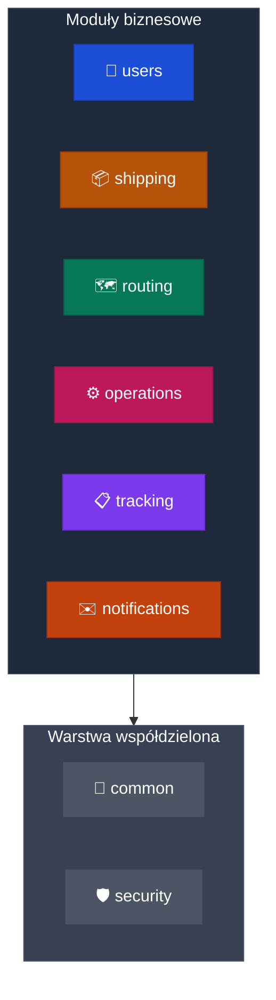

### Komunikacja przez eventy

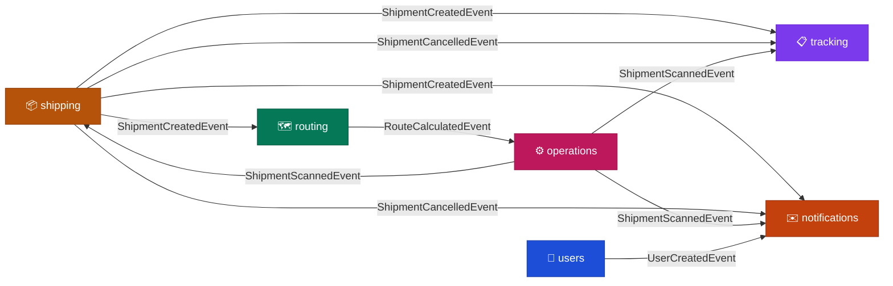

### Struktura każdego modułu

```
module/
├── api/            — kontrolery, DTO (records), mappery (MapStruct)
├── application/    — serwisy, listenery eventów, eventy
└── domain/         — encje JPA, repozytoria, wyjątki biznesowe
```

## Moduły

| Moduł | Odpowiedzialność |
|-------|-----------------|
| **users** | Konta użytkowników, JWT (access + refresh), role (ADMIN, COURIER, USER) |
| **security** | Spring Security, JWT filter, CORS, stateless session |
| **shipping** | Nadanie paczki, geokodowanie (Nominatim), etykieta PDF + QR → MinIO |
| **routing** | PostGIS ST_Contains na 380 powiatach, Dijkstra na 10 hubach |
| **operations** | Zadania kurierów, skanowanie QR, load-balancing, walidacja kolejności |
| **tracking** | Historia przesyłki, publiczny endpoint |
| **notifications** | Maile statusowe, Spring Mail + Mailtrap |
| **common** | Wyjątki, konfiguracje, AsyncConfig, DataInitializer |

## Przepływ paczki

### Nadanie paczki

```mermaid
sequenceDiagram
    actor K as Klient
    participant API as ShipmentController
    participant SH as ShipmentService
    participant NOM as Nominatim API
    participant MIO as MinIO
    participant R as RoutingService
    participant OPS as CourierService
    participant TR as TrackingService
    participant ML as EmailService

    K->>API: POST /api/v1/shipments
    API->>SH: createShipment()

    rect rgb(30, 58, 138)
        Note right of SH: Geokodowanie
        SH->>NOM: geocode(adres nadawcy)
        NOM-->>SH: lat, lon
        SH->>NOM: geocode(adres odbiorcy)
        NOM-->>SH: lat, lon
    end

    rect rgb(146, 64, 14)
        Note right of SH: Generowanie etykiety
        SH->>MIO: upload(PDF + QR)
        MIO-->>SH: labelUrl
    end

    SH->>SH: save(Shipment)
    SH-->>K: 201 Created

    rect rgb(55, 65, 81)
        Note over SH,ML: Asynchroniczne przetwarzanie (osobne wątki)
        SH-)R: ShipmentCreatedEvent
        SH-)TR: ShipmentCreatedEvent
        SH-)ML: ShipmentCreatedEvent

        R->>R: PostGIS → Dijkstra → save(Route)
        R-)OPS: RouteCalculatedEvent
        OPS->>OPS: createTasks(7 zadań)
        TR->>TR: save(TrackingEvent CREATED)
        ML->>ML: sendEmail(odbiorca)
    end
```

### Skanowanie przez kuriera

```mermaid
sequenceDiagram
    actor KR as Kurier
    participant API as OperationsController
    participant OPS as OperationsService
    participant DB as TaskRepository
    participant SH as ShipmentService
    participant TR as TrackingService
    participant ML as EmailService

    KR->>API: POST /api/v1/operations/scan
    API->>OPS: scanShipment(trackingNumber, userId)

    rect rgb(30, 58, 138)
        Note right of OPS: Walidacja
        OPS->>DB: findNextPendingTask()
        DB-->>OPS: Task (PENDING)
        OPS->>OPS: validatePreviousTask()
        OPS->>OPS: validateCourier()
    end

    OPS->>DB: save(Task → COMPLETED)
    OPS-->>KR: 200 OK

    rect rgb(55, 65, 81)
        Note over OPS,ML: Asynchroniczne przetwarzanie
        OPS-)SH: ShipmentScannedEvent
        OPS-)TR: ShipmentScannedEvent
        OPS-)ML: ShipmentScannedEvent

        SH->>SH: updateStatus()
        TR->>TR: save(TrackingEvent)
        ML->>ML: sendEmail()
    end
```

## Mapa eventów

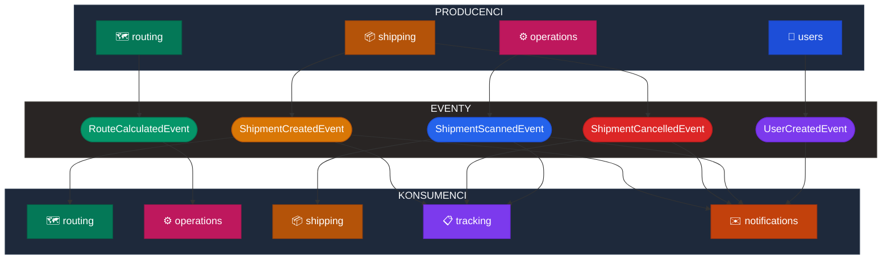

## Sieć logistyczna

### Huby i połączenia

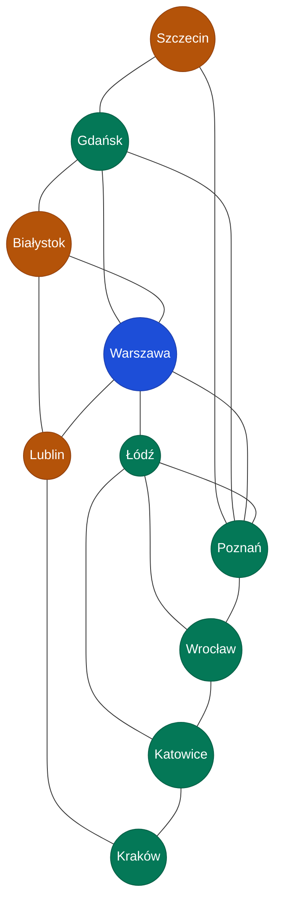

### Przykładowa trasa: Warszawa → Kraków (284 min)

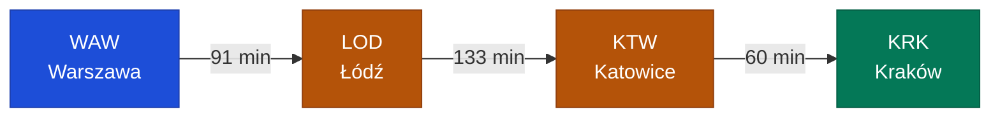

### Zadania kurierów dla tej trasy

```mermaid
graph LR
    P["1. PICKUP\nKurier WAW"] --> HD["2. HUB_DROPOFF\nKurier WAW"]
    HD --> L1["3. LINE_HAUL\nWAW → LOD"]
    L1 --> L2["4. LINE_HAUL\nLOD → KTW"]
    L2 --> L3["5. LINE_HAUL\nKTW → KRK"]
    L3 --> HP["6. HUB_PICKUP\nKurier KRK"]
    HP --> D["7. DELIVERY\nKurier KRK"]

    style P fill:#1d4ed8,stroke:#1e40af,color:#ffffff
    style HD fill:#1d4ed8,stroke:#1e40af,color:#ffffff
    style L1 fill:#b45309,stroke:#92400e,color:#ffffff
    style L2 fill:#b45309,stroke:#92400e,color:#ffffff
    style L3 fill:#b45309,stroke:#92400e,color:#ffffff
    style HP fill:#047857,stroke:#065f46,color:#ffffff
    style D fill:#047857,stroke:#065f46,color:#ffffff
```

## Cykl życia statusów paczki

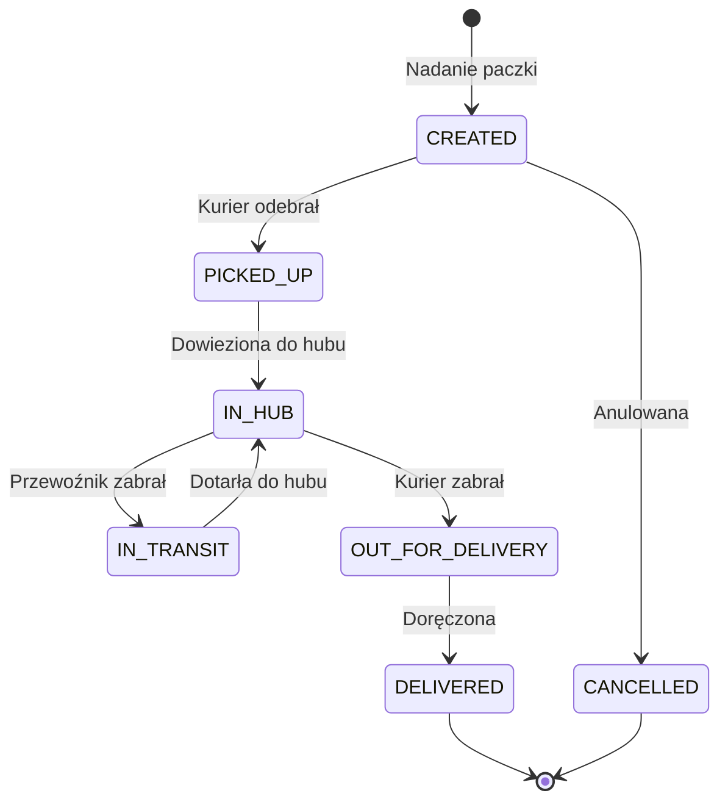

## Infrastruktura

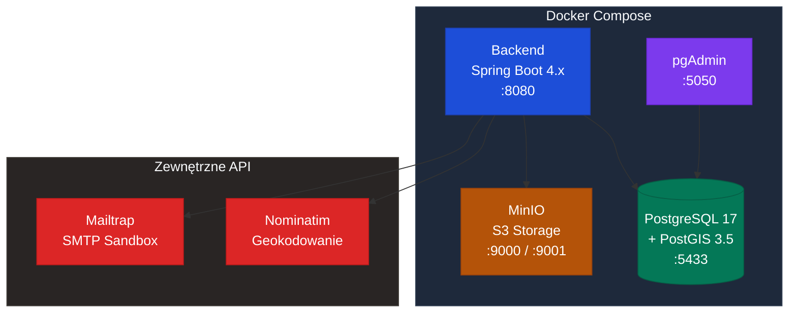

## Bezpieczeństwo — JWT Flow

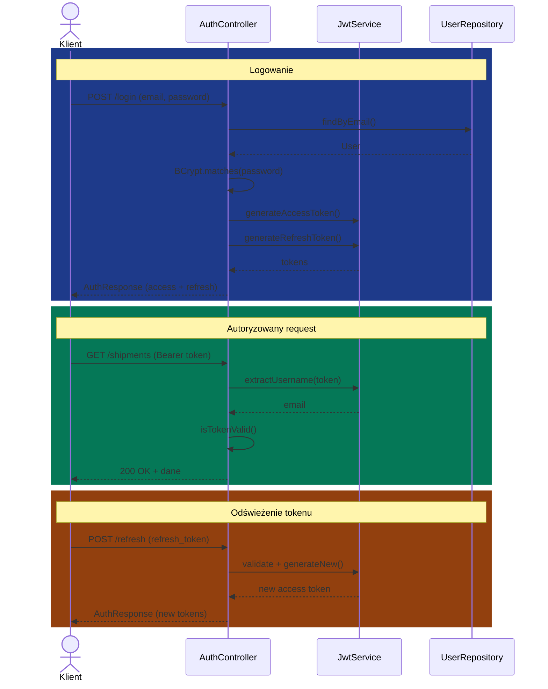

## Uruchomienie

### Wymagania
- Docker + Docker Compose
- Konto Mailtrap (darmowe — sandbox.smtp.mailtrap.io)

### Krok 1 — Konfiguracja

Skopiuj `.env.example` do `.env` i uzupełnij wartości:


```env
# Baza danych
POSTGRES_USER=postgres
POSTGRES_PASSWORD=your_password
POSTGRES_DB=wolfship_db

# JWT
JWT_SECRET=your_jwt_secret_min_256_bits_base64_encoded
JWT_EXPIRATION_MS=86400000
JWT_REFRESH_EXPIRATION_MS=604800000

# MinIO
MINIO_ROOT_USER=admin
MINIO_ROOT_PASSWORD=adminpassword
MINIO_ENDPOINT=http://wolfship-minio:9000
MINIO_BUCKET_NAME=wolfship-labels

# Mail (Mailtrap)
MAIL_HOST=sandbox.smtp.mailtrap.io
MAIL_PORT=2525
MAIL_USERNAME=your_mailtrap_username
MAIL_PASSWORD=your_mailtrap_password

# Admin
ADMIN_EMAIL=admin@wolfship.com
ADMIN_PASSWORD=admin
```

### Krok 2 — Uruchomienie

```bash
docker-compose up --build
```

Aplikacja wystartuje na `http://localhost:8080`. Przy pierwszym uruchomieniu:
- Flyway wykonuje migracje (tabele, huby, strefy, połączenia)
- DataInitializer tworzy role, admina i 397 testowych kurierów


### Dostępne usługi

| Usługa | URL |
|--------|-----|
| Backend API | http://localhost:8080 |
| Swagger UI | http://localhost:8080/swagger-ui.html |
| MinIO Console | http://localhost:9001 |
| pgAdmin | http://localhost:5050 |

## Konfiguracja

### Zmienne środowiskowe

Wszystkie wrażliwe dane przechowywane w `.env` (nie commitowany do repozytorium). Plik `.env.example` zawiera listę wymaganych zmiennych bez wartości.

### Dane testowe

| Typ | Format emaila | Przykład | Hasło |
|-----|--------------|----------|-------|
| Admin | admin@wolfship.com | admin@wolfship.com | admin |
| Kurier strefowy | courier.{TERYT}@wolfship.com | courier.1465@wolfship.com (Warszawa) | password |
| Przewoźnik | linehaul.{KOD1}.{KOD2}@wolfship.com | linehaul.KRK.KTW@wolfship.com | password |

### Huby logistyczne

| Kod | Miasto |
|-----|--------|
| WAW | Warszawa |
| KRK | Kraków |
| WRO | Wrocław |
| POZ | Poznań |
| GDA | Gdańsk |
| KTW | Katowice |
| LOD | Łódź |
| SZC | Szczecin |
| LBL | Lublin |
| BIA | Białystok |

## API Endpoints

### Autoryzacja

| Metoda | Endpoint | Opis | Autoryzacja |
|--------|----------|------|-------------|
| POST | /api/v1/auth/login | Logowanie | Publiczny |
| POST | /api/v1/auth/register | Rejestracja | Publiczny |
| POST | /api/v1/auth/refresh | Odświeżenie tokenu | Publiczny |
| POST | /api/v1/auth/change-password | Zmiana hasła | Uwierzytelniony |
| POST | /api/v1/auth/logout | Wylogowanie | Uwierzytelniony |

### Przesyłki

| Metoda | Endpoint | Opis | Autoryzacja |
|--------|----------|------|-------------|
| POST | /api/v1/shipments | Nadanie paczki | Uwierzytelniony |
| GET | /api/v1/shipments | Moje paczki | Uwierzytelniony |
| GET | /api/v1/shipments/{trackingNumber} | Szczegóły paczki | Uwierzytelniony |
| DELETE | /api/v1/shipments/{trackingNumber} | Anulowanie | Uwierzytelniony |
| GET | /api/v1/shipments/{trackingNumber}/label | Pobierz etykietę PDF | Uwierzytelniony |

### Routing

| Metoda | Endpoint | Opis | Autoryzacja |
|--------|----------|------|-------------|
| GET | /api/v1/routing/shipments/{shipmentId}/route | Trasa paczki | Uwierzytelniony |

### Operations

| Metoda | Endpoint | Opis | Autoryzacja |
|--------|----------|------|-------------|
| POST | /api/v1/operations/scan | Skanowanie QR | COURIER |
| GET | /api/v1/operations/my-tasks | Zadania kuriera | COURIER |
| GET | /api/v1/operations/unassigned-tasks | Nieprzypisane zadania | ADMIN |
| POST | /api/v1/operations/couriers | Przypisanie kuriera | ADMIN |
| GET | /api/v1/operations/couriers/{id} | Profil kuriera | ADMIN |

### Tracking

| Metoda | Endpoint | Opis | Autoryzacja |
|--------|----------|------|-------------|
| GET | /api/v1/tracking/{trackingNumber}/history | Historia przesyłki | Publiczny |

### Użytkownicy

| Metoda | Endpoint | Opis | Autoryzacja |
|--------|----------|------|-------------|
| POST | /api/v1/users | Tworzenie użytkownika | ADMIN |
| GET | /api/v1/users | Lista użytkowników | ADMIN |
| GET | /api/v1/users/{id} | Szczegóły użytkownika | ADMIN |
| PUT | /api/v1/users/{id} | Edycja użytkownika | ADMIN |
| DELETE | /api/v1/users/{id} | Dezaktywacja (soft delete) | ADMIN |

## Testowanie

### Pełny flow w Postmanie

**1. Zaloguj się jako admin:**
```json
POST /api/v1/auth/login
{ "email": "admin@wolfship.com", "password": "admin" }
```

**2. Nadaj paczkę:**
```json
POST /api/v1/shipments
{
  "senderAddress": {
    "fullName": "Jan Kowalski",
    "email": "jan@test.com",
    "phoneNumber": "123456789",
    "street": "Marszałkowska",
    "houseNumber": "1",
    "city": "Warszawa",
    "zipCode": "00-001",
    "country": "PL"
  },
  "receiverAddress": {
    "fullName": "Anna Nowak",
    "email": "anna@test.com",
    "phoneNumber": "987654321",
    "street": "Floriańska",
    "houseNumber": "1",
    "city": "Kraków",
    "zipCode": "31-019",
    "country": "PL"
  },
  "size": "M"
}
```

**3. Zaloguj się jako kurier i skanuj kolejne etapy:**
```
courier.1465@wolfship.com → PICKUP, HUB_DROPOFF
linehaul.LOD.WAW@wolfship.com → LINE_HAUL (WAW→LOD)
linehaul.KTW.LOD@wolfship.com → LINE_HAUL (LOD→KTW)
linehaul.KRK.KTW@wolfship.com → LINE_HAUL (KTW→KRK)
courier.1261@wolfship.com → HUB_PICKUP, DELIVERY
```

**4. Sprawdź pełną historię:**
```
GET /api/v1/tracking/{trackingNumber}/history
```


## Licencja

Projekt edukacyjny — nie przeznaczony do użytku komercyjnego.
